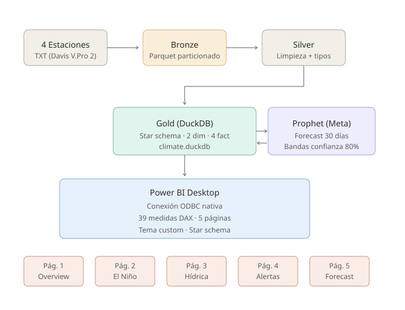
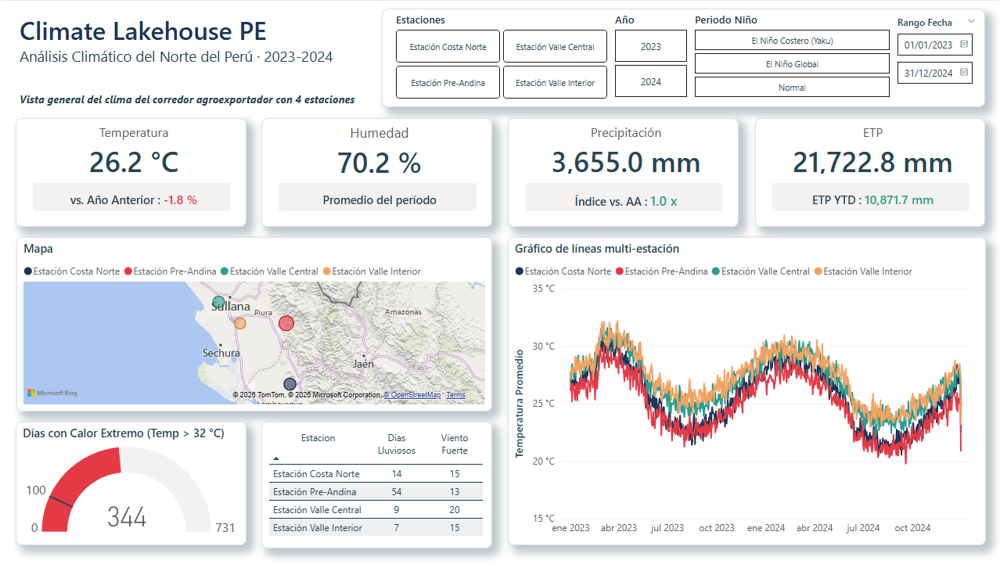
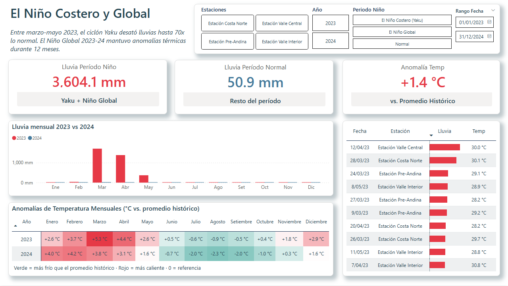
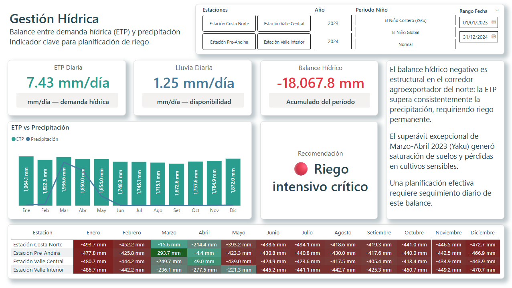
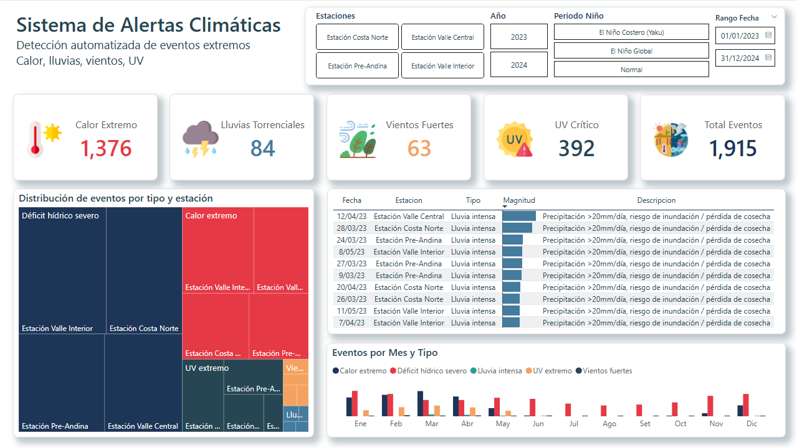
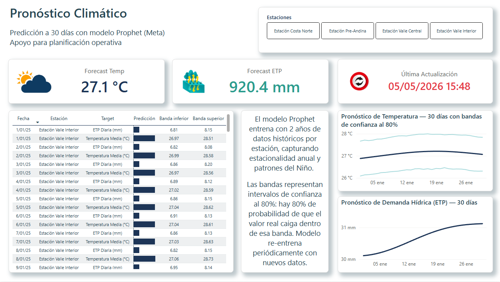

# Climate Lakehouse PE 🌦️

Arquitectura lakehouse moderna para analítica climática en agroindustria peruana. Dataset sintético que replica patrones climáticos reales del corredor agroexportador del norte del Perú (Piura/Lambayeque) — incluye el Niño Costero 2023 (Yaku) y el Niño Global 2023-24.

> **Inspirado en un caso real de modernización:** transformar un proceso legacy de archivos TXT diarios + macros de Excel en un pipeline ELT moderno (DuckDB + Parquet + arquitectura medallion + forecasting con ML).



---

## 🎯 Qué demuestra este proyecto

| Capacidad | Implementación |
|---|---|
| **Data Engineering** | Pipeline ELT con arquitectura medallion (Bronze / Silver / Gold) |
| **Stack moderno** | DuckDB + Parquet + Python — sin costo de cloud, experiencia lakehouse completa |
| **Modelado dimensional** | Star schema Kimball (2 dimensiones, 4 facts) |
| **DAX avanzado** | 39 medidas con Time Intelligence, detección de anomalías, analítica prescriptiva |
| **Dominio de herramientas** | Tabular Editor 2 (despliegue de medidas vía script C#), DAX Studio, Bravo |
| **Forecasting ML** | Prophet (Meta) — pronóstico a 30 días con bandas de confianza al 80% |
| **Storytelling de datos** | 5 páginas de dashboard con narrativa progresiva |
| **Conocimiento de dominio** | Lenguaje agroindustrial: ETP, balance hídrico, recomendaciones de riego |

---

## 📊 Dashboard

5 páginas que cuentan la historia climática del corredor agroexportador del norte peruano:

| Página | Historia | Visualizaciones clave |
|---|---|---|
| **1. Overview** | Vista general del clima regional | KPIs, mapa coroplético, series de tiempo |
| **2. El Niño 2023-24** | Impacto del Yaku y anomalías del Niño Global | Lluvia YoY, heatmap mensual, top eventos |
| **3. Gestión Hídrica** | Balance ETP vs precipitación — necesidades de riego | Heatmap balance hídrico, recomendación prescriptiva |
| **4. Alertas Climáticas** | Eventos extremos detectados (calor, lluvia, viento, UV) | KPIs por tipo, treemap, distribución mensual |
| **5. Pronóstico** | Forecast a 30 días (Prophet) para temperatura y ETP | Series de tiempo con bandas de confianza, tabla detallada |

### Capturas


*Página 1 — Vista general del clima regional*


*Página 2 — Impacto documentado del Yaku y Niño Global*


*Página 3 — Balance hídrico con recomendación prescriptiva*


*Página 4 — Sistema automatizado de detección de eventos extremos*


*Página 5 — Pronóstico con Prophet (Meta)*

---

## 🏗️ Arquitectura

### Flujo de datos medallion

```
4 Estaciones       Bronze              Silver              Gold (DuckDB)
(Davis V.Pro 2)    (Parquet crudo)     (Parquet limpio)    (star schema)
    TXT       →    particionado   →    tipado, validado  →  dim_*, fact_*
                   por estación/        deduplicado          modelo relacional
                   año/mes
                                                                ↓
                                                          Power BI (ODBC)
                                                          Prophet → fact_forecast
```

### Stack técnico

- **Python 3.11+** — orquestación del pipeline
- **DuckDB** — motor analítico embebido (sin servidor)
- **Apache Parquet** — almacenamiento columnar con compresión Snappy
- **Prophet** — forecasting de series de tiempo (Meta)
- **Power BI Desktop** — dashboards (conexión ODBC a DuckDB)
- **Tabular Editor 2** — despliegue programático de medidas DAX
- **DAX Studio + Bravo** — optimización de queries y análisis del modelo

---

## 📁 Estructura del proyecto

```
climate-lakehouse-pe/
├── README.md                   ← Este documento
├── LICENSE                     ← MIT
├── requirements.txt            ← Dependencias Python
├── .gitignore
│
├── src/
│   ├── 01_generate_synthetic.py     ← Generador de datos sintéticos
│   ├── 02_ingest_to_bronze.py       ← TXT → Parquet (Bronze)
│   ├── 03_bronze_to_silver.py       ← Limpieza (Silver)
│   ├── 04_silver_to_gold.py         ← Star schema (Gold)
│   ├── 05_forecasting.py            ← Forecasting con Prophet
│   └── utils/
│       ├── stations.py              ← Configuración de las 4 estaciones
│       ├── climate_patterns.py      ← Estacionalidad, El Niño, ruido
│       └── meteorology.py           ← Penman-Monteith, punto de rocío, etc.
│
├── data/
│   ├── raw/                    ← 4 archivos TXT (esquema Davis Vantage Pro 2)
│   ├── bronze/                 ← Parquet crudo, particionado
│   ├── silver/                 ← Parquet limpio
│   └── gold/
│       └── climate.duckdb      ← Base analítica final
│
├── powerbi/
│   ├── ClimateLakehousePE.pbix      ← Dashboard (5 páginas)
│   ├── dax_measures.cs              ← Script C# para Tabular Editor (39 medidas)
│   └── climate_theme.json           ← Tema custom de Power BI
│
├── sql/                        ← Queries SQL standalone (DuckDB)
│
└── docs/
    ├── architecture.svg
    ├── dashboard_spec.md       ← Especificación visual de las 5 páginas
    └── screenshots/
        ├── 01_overview.png
        ├── 02_el_nino.png
        ├── 03_water.png
        ├── 04_alerts.png
        └── 05_forecast.png
```

---

## 🚀 Inicio rápido

### Requisitos

- Python 3.11+
- Power BI Desktop (Windows)
- DuckDB ODBC Driver — [descargar](https://duckdb.org/docs/installation/?version=stable&environment=odbc)

### Instalar dependencias

```bash
git clone https://github.com/szkad/climate-lakehouse-pe.git
cd climate-lakehouse-pe
python -m venv venv
venv\Scripts\activate          # Windows
# source venv/bin/activate     # Linux/Mac
pip install -r requirements.txt
```

### Correr el pipeline

```bash
python src/01_generate_synthetic.py    # ~7 seg, genera 140K registros
python src/02_ingest_to_bronze.py      # TXT → Parquet
python src/03_bronze_to_silver.py      # Limpieza
python src/04_silver_to_gold.py        # Construye star schema
python src/05_forecasting.py           # Entrena Prophet, escribe fact_forecast
```

Esto genera `data/gold/climate.duckdb` (~25 MB) listo para consumo desde Power BI.

### Abrir el dashboard

```
1. Abrir powerbi/ClimateLakehousePE.pbix en Power BI Desktop
2. Si pide refrescar datos: confirma y actualiza la conexión ODBC
   apuntando a tu data/gold/climate.duckdb local
3. Listo.
```

---

## 🔬 El dataset sintético

### ¿Por qué sintético?

El proyecto está inspirado en experiencia real con estaciones meteorológicas Davis Vantage Pro 2 en agroindustria del norte del Perú, pero **toda la data es 100% sintética y publicable**. No se expone ninguna información confidencial de ninguna empresa.

### Qué tiene de realista

El generador implementa:

- **Estacionalidad anual** — ciclos de verano/invierno austral
- **Ciclo diurno** — temperatura pico a las 14:00, mínima a las 05:00
- **Diferenciación entre estaciones** — costa vs valles vs pre-andina
- **Niño Costero 2023 (Yaku)** — episodio de lluvias intensas marzo-mayo 2023
- **Niño Global 2023-24** — anomalías de temperatura por 12 meses
- **Episodios de tormenta** — ráfagas torrenciales concentradas durante el Niño
- **Eventos de viento** — 5-7 episodios de ráfagas fuertes por año por estación
- **Ruido AR(1)** — variabilidad climática autocorrelacionada realista
- **Datos faltantes** — ~0.3% NaN simulando glitches reales de estaciones

### Variables (39 columnas, esquema Davis Vantage Pro 2)

Mediciones primarias:
`temp_out_c`, `humidity_pct`, `wind_speed_kmh`, `wind_dir`, `pressure_hpa`, `precip_mm`, `solar_wm2`, `uv_index`

Derivadas usando **fórmulas meteorológicas reales:**
- `dew_point_c` — fórmula de Magnus-Tetens
- `heat_index_c` — regresión Rothfusz del NWS
- `wind_chill_c` — fórmula oficial del NWS
- `thsw_index_c` — temperatura aparente con componente solar
- `etp_mm` — **Penman-Monteith FAO-56** (métrica clave de riego)
- `air_density` — ley de gas ideal con corrección de vapor

Esto es meteorología estándar de la industria, no números aleatorios.

---

## 🎨 Decisiones de diseño

### ¿Por qué DuckDB + Parquet?

DuckDB es el desarrollo más interesante en analítica moderna: poder OLAP completo de SQL sin necesidad de servidor. Lee y escribe Parquet nativamente, se integra con Python, y conecta a BI tools vía ODBC. **Perfecto para proyectos donde desplegar un cloud warehouse sería overkill.**

### ¿Por qué un dataset sintético y no Kaggle?

Dos razones:
1. **Diferenciación** — cualquiera puede usar un dataset de Kaggle; pocos pueden diseñar uno realista para un dominio específico.
2. **Conocimiento de dominio** — diseñar un generador que captura patrones del Niño, física de la ETP, y el esquema Davis Vantage Pro 2 demuestra entendimiento del dominio de la meteorología agrícola.

### ¿Por qué incluir forecasting?

La mayoría de proyectos BI son descriptivos (¿qué pasó?). Los proyectos BI top son predictivos (¿qué pasará?) y prescriptivos (¿qué deberíamos hacer?). Este proyecto incluye los tres:

- Páginas 1, 2, 4 → **Descriptivo**
- Página 5 → **Predictivo** (forecast con Prophet)
- Página 3 → **Prescriptivo** (recomendación de riego)

---

## 📈 Insights de muestra del dashboard

- **El balance hídrico es estructuralmente negativo** en la costa norte peruana: la ETP supera la precipitación en 92 de los 96 meses-estación del período (~96% del tiempo).
- **El Niño Costero 2023 multiplicó la lluvia por 70x** en algunas zonas (ej: marzo 2023 en zona Pre-Andina: 293mm vs ~4mm normal).
- **La zona Pre-Andina recibe el impacto más extremo** de los eventos del Niño costero, consistente con el comportamiento documentado de las estribaciones que amplifican las lluvias costeras.
- **El forecast para los próximos 30 días predice ETP > 7 mm/día** en todas las estaciones, indicando requerimientos sostenidos de riego intensivo.

---

## 🛠️ Highlights técnicos

### Tabular Editor + C# para despliegue de DAX

En lugar de hacer click en cada medida manualmente en Power BI Desktop, las 39 medidas del modelo se despliegan vía un script C# en Tabular Editor:

```csharp
M("Δ Temp vs AA",
  "[Temp Promedio] - [Temp Promedio AA]",
  "+0.0 °C;-0.0 °C;0",
  "03 Time Intelligence",
  "Diferencia vs mismo período del año anterior");
```

Esta es práctica estándar de la industria para equipos BI que manejan muchas medidas.

### Ejemplo de medida prescriptiva

La medida "Recomendación de Riego" va más allá de la analítica descriptiva:

```dax
Recomendación de Riego =
VAR Balance = [Balance Hídrico]
VAR Days = [Días con Datos]
VAR DailyBalance = DIVIDE(Balance, Days)
RETURN
SWITCH(
    TRUE(),
    DailyBalance > 0,    "✅ Sin necesidad de riego",
    DailyBalance > -3,   "🟡 Riego ligero recomendado",
    DailyBalance > -6,   "🟠 Riego moderado necesario",
    "🔴 Riego intensivo crítico"
)
```

---

## 📝 Licencia

MIT — ver [LICENSE](LICENSE)

## 👤 Autor

**Alexis Zapata** — Analista BI | Sullana, Perú
- GitHub: [@szkad](https://github.com/szkad)
- Background: 5+ años en agroindustria del norte peruano
- Stack: Power BI, DAX, SQL, Python, DuckDB, Parquet, Power Query
- Certificaciones: Google Advanced Data Analytics (Abril 2026)

---

## 🙏 Agradecimientos

- **Davis Instruments** por el esquema de referencia del Vantage Pro 2
- **Meta AI** por liberar Prophet como open source
- **DuckDB Labs** por democratizar los motores analíticos
- **La FAO** por la documentación de la ecuación de Penman-Monteith
